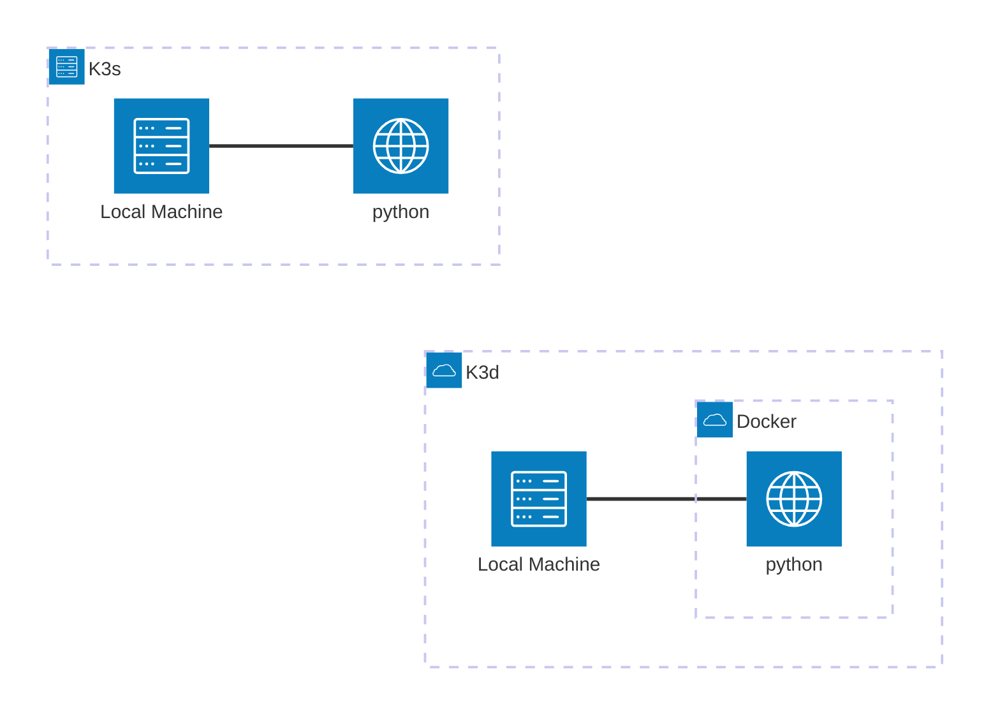

# Part 3: K3d and Argo CD

Este módulo consiste no desenvolvimento de uma infraestrutura local de Entrega Contínua (CD) utilizando K3d e Argo CD, simulando um pipeline GitOps automatizado sem o uso de Vagrant.

## Escopo e Requisitos

O objetivo desta etapa é configurar um fluxo onde qualquer alteração no repositório remoto do GitHub seja automaticamente sincronizada e refletida no cluster local.

### 1. Ambiente Local
* Instalação e configuração do K3d (rodando sobre Docker) na máquina virtual servindo de host.
* Criação de um script de automação para a instalação de todos os pacotes e dependências necessárias para o funcionamento do ambiente.

### 2. Namespaces do Cluster
O cluster deve obrigatoriamente possuir dois ambientes isolados:
* argocd: Destinado exclusivamente à instalação e gerenciamento do Argo CD.
* dev: Onde a aplicação final será implantada e executada.

### 3. Aplicação e Deploy Automático (GitOps)
* A implantação na namespace dev deve ser gerenciada pelo Argo CD a partir de um repositório público no GitHub.
* A aplicação deve possuir duas versões distintas (tag v1 e tag v2) publicadas no Docker Hub.
* Fluxo de validação: Ao alterar a tag da imagem no manifesto de deploy dentro do GitHub, o Argo CD deve detectar a mudança, sincronizar o cluster automaticamente e disponibilizar a nova versão da aplicação.

